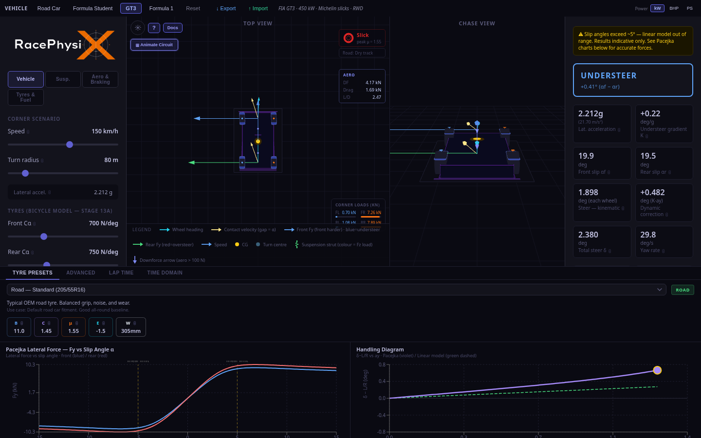

# RacePhysiX — Vehicle Dynamics & Lap Time Simulator

> **Adjust any setup parameter. See the physics change in real time. Predict lap times across 22 real-world circuits — entirely in your browser.**

[](https://racephysix.srikarbuddhiraju.com)
[](LICENSE)
[](https://github.com/sponsors/srikarbuddhiraju)

No install. No login. No account.

---



---

## What is RacePhysiX?

RacePhysiX is a **physics-accurate vehicle dynamics simulator** that runs entirely in the browser. It covers the full engineering stack — from tyre contact patch forces to race strategy — and gives instant feedback as you tune any of 56 vehicle parameters.

Change spring rates, aero balance, brake bias, tyre compound, or driver aggression and immediately see:
- **Understeer gradient and handling balance** (Pacejka Magic Formula tyre model)
- **Predicted lap time** across 22 real circuits (Spa, Monza, Silverstone, Suzuka, and more)
- **Tyre temperature and wear** lap-by-lap through a race
- **Optimal race strategy** (pit stop windows, compound selection)
- **14-DOF time-domain response** to step steer, sine sweep, and brake-in-turn inputs

---

## Who is it for?

| Audience | How they use it |
|---|---|
| 🎓 **Motorsport engineering students** | Learn vehicle dynamics from first principles with immediate visual feedback |
| 🏎️ **Formula Student / FSAE teams** | Quick setup direction — spring rates, ARB, aero balance, brake bias |
| 🕹️ **Sim racers** | Build intuition for how setup changes translate to lap time |
| 🔬 **Curious engineers** | Explore Pacejka, Magic Formula, load transfer, and the bicycle model interactively |

---

## Features

### Physics — 46 stages, fully validated

- **Pacejka Magic Formula tyre model** — nonlinear Fy/Fx, load sensitivity, combined slip (MF-Swift)
- **Full suspension model** — roll stiffness, ARB, roll centre, motion ratio, dynamic camber gain
- **Aerodynamics** — speed-dependent downforce + drag, pre-computed CFD aero map (ride height × yaw), ERS/hybrid
- **Lap time estimator** — point-mass quasi-static sim over real circuit segment geometry
- **14-DOF time-domain** — RK4 ODE solver, step steer / sine sweep / brake-in-turn ISO scenarios
- **Race simulation** — multi-lap tyre warmup/degradation, fuel burn, sector times, gap-to-fastest
- **Race strategy optimiser** — brute-force 1/2-stop windows over soft/medium/hard compounds
- **Setup optimiser** — Nelder-Mead simplex over 7 parameters → minimum lap time
- **Tyre thermal + wear model** — Gaussian μ bell curve vs temperature; soft/medium/hard/inter/wet
- **Engine torque curve** — NA bell, turbo plateau, electric flat; gear model with rev-limited P/V curve
- **Driver model** — aggression 0–100%: scales tyre heat rate, wear rate, μ utilisation
- **Multi-car comparison** — mass / power / peak μ vs baseline, Δ lap time cards

All 37 physics validation checks pass. Extended suite: 424/424 pass.

### Interface

**Left panel** — 56 vehicle parameters grouped by system: Mass & Geometry, Tyres, Suspension, Brakes, Aerodynamics, Powertrain, Race, Driver, Ambient. One-click presets: Road car / Formula Student / GT3 / F1.

**Centre** — Animated top-down circuit map with live telemetry strip (speed, gear, RPM, G-forces) and zone overlay (braking / trail-braking / cornering / full-throttle). Zones shift in real time when you change any parameter.

**Right panel** — Physics results, lap time breakdown, race simulation, setup comparison (baseline vs variant Δ lap time), data export (CSV: lap trace, race telemetry).

**Bottom** — Tyre curve (Fy vs slip angle), handling diagram (steering vs lateral G), Pacejka coefficient tuner, 14-DOF time-domain plots.

---

## Circuits (22 total)

**Generic (4):** Club (~1.9 km), Karting (~1.0 km), GT Circuit (~3.2 km), Formula Test (~2.1 km)

**Schematic real circuits (4):** Monza, Spa-Francorchamps, Silverstone, Suzuka

**GPS-accurate — TUMFTM (LGPL-3.0, 10):**
Nürburgring GP, Bahrain/Sakhir, Barcelona/Catalunya, Hungaroring, Montreal,
Brands Hatch, Hockenheim, Red Bull Ring/Spielberg, Zandvoort, São Paulo/Interlagos

**GPS-accurate — OSM (ODbL, 4):**
Laguna Seca, Imola, Le Mans, Mugello

---

## GT3 Validation (BMW M4 GT3 2023, qualifying)

| Circuit | Model | Real reference | Δ |
|---|---|---|---|
| Spa-Francorchamps | 2:13.8 | ~2:13–2:17 | ✓ |
| Monza | 1:50.2 | ~1:49–1:53 | ✓ |
| Silverstone | 2:00.8 | ~2:00–2:04 | ✓ |
| Imola | 1:53.0 | ~1:52–1:56 | ✓ |
| Red Bull Ring | 1:25.2 | ~1:24–1:28 | ✓ |
| Hockenheim | 1:34.8 | ~1:34–1:38 | ✓ |
| Zandvoort | 1:31.3 | ~1:31–1:35 | ✓ |
| São Paulo | 1:33.9 | ~1:32–1:36 | ✓ |

Overall accuracy: ±5–10% vs real-world lap times (adequate for setup direction decisions).

---

## Running Locally

```bash
npm install
npm run dev
```

Build for production:

```bash
npm run build
```

---

## Physics Validation

```bash
npx tsx src/physics/validate.ts
```

37 physics checks against Gillespie Ch.6 (bicycle model), RCVD Ch.16 (suspension),
Pacejka §4.3 (tyre), and the 14-DOF time-domain model. Extended suite: 424/424 pass.

---

## Tech Stack

TypeScript · React · Vite · Three.js · Recharts · Cloudflare Pages

---

## Physics Model — Full Stage List

<details>
<summary>Click to expand (46 stages)</summary>

| Stage | Model | What it captures |
|---|---|---|
| 1 | Bicycle model | Steady-state yaw, understeer gradient, slip angles (Gillespie Ch.6) |
| 2 | Pacejka Magic Formula | Nonlinear tyre lateral + longitudinal forces (RCVD Ch.2) |
| 3 | Load transfer + drivetrain | Per-corner Fz, combined slip, FWD/RWD/AWD/AWD+TV |
| 4 | Suspension (roll stiffness) | Roll angle, ARB contribution, accurate Fz split front/rear |
| 5 | Braking model | Brake bias, ABS clip, combined braking + cornering friction circle |
| 6 | Aerodynamics | Speed-dependent downforce + drag, front/rear aero balance |
| 7 | Lap time estimator | Point-mass simulation over corner + straight segments |
| 8 | 14-DOF time domain | Step steer / sine sweep / brake-in-turn, RK4 ODE solver |
| 9 | Tyre load sensitivity | Pacejka degressive μ with Fz (qFz parameter) |
| 10 | Gear model + powertrain | Gear ratios, shift points, rev-limited P/V curve |
| 11 | Tyre thermal model | μ bell curve vs temperature, warmup + degradation |
| 12 | Setup optimisation | Nelder-Mead simplex over 7 params → minimum lap time |
| 13 | Full nonlinear model | Separate F/R Cα, friction circle, yaw transient penalty |
| 14 | Race simulation | Multi-lap: tyre warmup/degradation, fuel burn, sector times |
| 15 | Track editor | Editable segment table, SVG preview, JSON import/export |
| 16 | GPS circuit maps | 22 circuits — TUMFTM (LGPL-3.0) + OSM (ODbL) GPS paths |
| 18 | Vehicle presets | Road / Formula Student / GT3 / F1 one-click parameter sets |
| 19 | Onboarding | First-visit dismissible banner, localStorage flag |
| 20 | Setup comparison | Save baseline → run variant → Δ lap time side-by-side |
| 22 | Camber + toe | Camber thrust + toe effective Cα in bicycle + Pacejka models |
| 23 | Tyre wear model | Soft/medium/hard/inter/wet — warmup, linear wear, cliff, graining |
| 24 | Wind + ambient | ISA air density (altitude + temp), headwind drag, crosswind μ |
| 25 | Driver model | Aggression 0–100%: tyre heat rate, wear rate, μ utilisation scaling |
| 26 | Differential model | Open / LSD / Locked — traction efficiency + yaw moment (RCVD Ch.22) |
| 27 | Brake temperature | Disc temp per lap, Gaussian fade model, braking capacity scaling |
| 28 | Tyre pressure | Cα × (p/2.0)^0.35, μ × (2.0/p)^0.10 (Pacejka §4.3.1) |
| 29 | Ride height + rake | Rake → aero balance shift; ground effect via Stage 46 CFD map |
| 30 | Race strategy optimizer | Brute-force 1/2-stop over soft/medium/hard, per-stint grip model |
| 31 | Engine torque curve | NA bell curve, turbo flat plateau after boost RPM, electric flat |
| 32 | Traction control | Driven axle slip ratio threshold — clamps drive force |
| 33 | Track rubber evolution | peakMu × (1 + 0.15 × rubberLevel) — green to fully rubbed |
| 34 | Wet track + drying line | Per-compound wetGripFactor — slick → 0.30 at standing water |
| 35 | ERS / Hybrid | MGU-K additive force, deploy strategies, energy budget |
| 36 | Multi-car comparison | Mass/power/peakMu vs baseline — Δ lap time comparison cards |
| 37 | Track banking + elevation | Banked corner FBD (Milliken RCVD §2.5), gradient drive/brake forces |
| 38 | Data export | Lap trace + race telemetry CSV (speed, gear, RPM, G-forces, zone) |
| 39 | Telemetry overlay | Upload any lap trace CSV — compare against sim in overlaid charts |
| 40 | MF-Swift combined slip | Pacejka Fx + Gky/Gxa cosine reduction (replaces Kamm circle) |
| 41 | Roll centre + dynamic camber | Geometric/elastic load transfer split; outer tyre camber gain from roll |
| 42 | Suspension motion ratio | Wheel rate = spring rate × MR²; ARB already at wheel rate; accurate roll stiffness |
| 43 | Roll damper model | Critical damping ratio ζ for body roll in 14-DOF transient sim |
| 44 | Crosswind in balance model | Lateral crosswind force added to tyre load balance in Pacejka model |
| 45 | Tyre thermal core | Two-layer surface/core model; μ evaluated at core temp; coreTemp lags surface via tyreCoreHeatLag |
| 46 | Pre-computed CFD aero map | 2D lookup [rideHeight × yaw] per vehicle class — non-linear ground effect + yaw CD penalty |

</details>

---

## Disclaimers

**Lap time estimator** uses a point-mass quasi-static model. It does not simulate tyre
warm-up laps, traction control intervention, or driver variation. Predictions are indicative —
expect ±5–15% vs real-world lap times depending on car category.

**Tyre model** uses generic Pacejka coefficients. Real homologated compound data is not
available. Corner speed predictions will differ from real measured data.

**Not for real vehicle setup decisions.** RacePhysiX is an educational and enthusiast tool.
Do not use outputs for professional motorsport engineering decisions.

---

## Sponsorship

RacePhysiX is free and open-source. If it's saved you time or money — on a race weekend,
a Formula Student project, or an engineering coursework — a GitHub Sponsor contribution
keeps the server running and the physics improving.

[](https://github.com/sponsors/srikarbuddhiraju)

All sponsors are listed in [SPONSORS.md](SPONSORS.md).

---

## Attribution

**TUMFTM circuits (10):** GPS data from the
[TUMFTM Racetrack Database](https://github.com/TUMFTM/racetrack-database)
(Technical University of Munich, Institute of Automotive Technology),
licensed under [LGPL-3.0](https://www.gnu.org/licenses/lgpl-3.0.txt).
See [`LICENSES/TUMFTM-LGPL-3.0.txt`](LICENSES/TUMFTM-LGPL-3.0.txt).

**OSM circuits (4):** GPS data © [OpenStreetMap contributors](https://www.openstreetmap.org/copyright),
licensed under the [Open Database Licence (ODbL)](https://opendatacommons.org/licenses/odbl/).

---

## Licence

RacePhysiX uses a **dual-licence** model:

**[AGPL-3.0](LICENSE)** — free for non-commercial use (students, researchers, hobbyists,
Formula Student teams, open-source projects). If you run a modified version as a
network service, you must make the source code available to users.

**[Commercial licence](COMMERCIAL_LICENSE.md)** — required for closed-source products,
white-label deployments, or commercial SaaS without source disclosure.
Contact: racephysix@srikarbuddhiraju.com

Circuit GPS data: LGPL-3.0 (TUMFTM) · ODbL (OSM)
